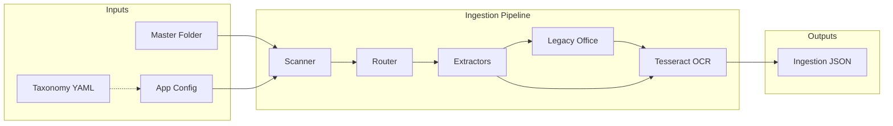
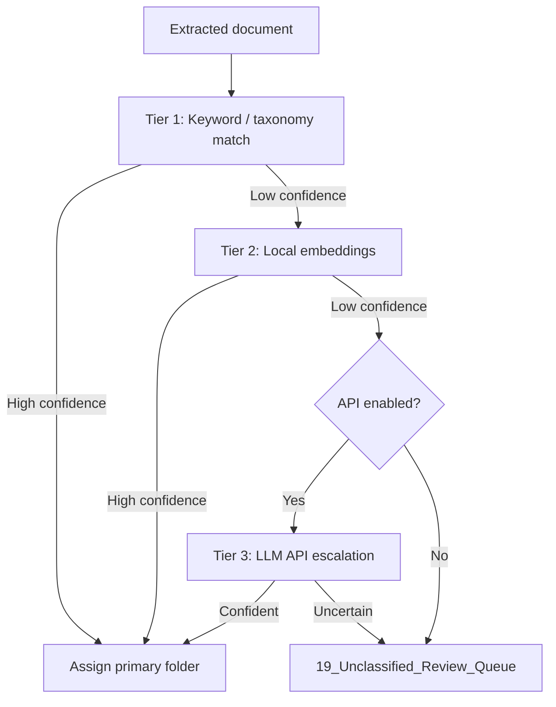

# Architecture Document
## AI-Assisted Data Room File Organizer

| | |
|---|---|
| **Version** | 0.4.0 |
| **Milestone** | M1 Ingestion + M2 Prototype + M3 Enterprise + M4 Production |
| **Status** | Delivered |
| **Date** | June 2026 |
| **Client** | Carl Quesinberry |

---

## 1. Executive summary

This document describes the technical architecture: a **local document ingestion system** (M1) plus a **classification and organization prototype** (M2) that copies files into taxonomy folders with CSV manifest and review queue outputs.

The system includes a **config-driven taxonomy YAML** (folders `00`–`19`), a **hybrid local-first classification engine** (§5), and CLI commands including `dataroom run` for the full pipeline.

Design principles align with the full project vision: originals untouched, domain-flexible taxonomy, local-first processing, no silent failures, and audit-friendly outputs.

---

## 2. System context



---

## 3. Pipeline stages

### Stage 1 — Scan

- Recursively walk the master input folder (configurable).
- Filter by supported extensions in `config/default.yaml`.
- Collect filesystem metadata: size, created date, modified date.

**Module:** `dataroom.ingestion.scanner`

### Stage 2 — Extract

Route each file to a type-specific extractor:

| Type | Library / Tool | Notes |
|------|----------------|-------|
| PDF | PyMuPDF (`fitz`) | Native text first; OCR if text below threshold |
| DOCX | python-docx | Paragraph text |
| DOC | Legacy Office converter | Multi-step fallback chain |
| XLSX / XLS | openpyxl / xlrd | Cell text per sheet |
| PPTX | python-pptx | Slide shape text |
| PPT | Legacy Office converter | Multi-step fallback chain |
| Images | Pillow + Tesseract | OCR-only (`.jpg`, `.jpeg`, `.png`, `.tif`, `.tiff`) |
| TXT | stdlib | Multi-encoding fallback |
| EML / MSG | stdlib / extract-msg | Native email header and body parsing |

**Modules:** `dataroom.ingestion.extractors`, `dataroom.ingestion.router`, `dataroom.ingestion.extractors.legacy_office`

#### Legacy Office fallback chain (`.doc` and `.ppt`)

Legacy binary Office formats cannot be read by `python-docx` or `python-pptx`. The system tries methods in order until text is extracted. If all methods fail, a clear error is recorded.

**`.doc` fallback order:**

1. LibreOffice headless → convert to `.docx` → extract text
2. Microsoft Word COM automation (Windows, if Office installed) → `.docx` → extract text
3. `antiword` CLI (if on PATH)
4. `catdoc` CLI (if on PATH)
5. LibreOffice → convert to PDF → Tesseract OCR

**`.ppt` fallback order:**

1. LibreOffice headless → convert to `.pptx` → extract text
2. Microsoft PowerPoint COM automation (Windows, if Office installed) → `.pptx` → extract text
3. LibreOffice → convert to PDF → Tesseract OCR

Each successful extraction records the method in `ExtractedDocument.extra.legacy_extraction_method`.

### Stage 3 — OCR

Triggered when native text is below `min_native_text_chars` (default 50) for PDFs, always for images, and as a last resort for legacy Office files.

1. PDF → render pages via `pdf2image` (Poppler) at configurable DPI (default 300).
2. Run Tesseract (`pytesseract`) with configurable language.
3. Store `text_content` (native) and `ocr_text` (supplement) separately.
4. Set `extraction_method`: `native`, `ocr`, or `hybrid`.

If Tesseract is unavailable, record a warning and continue with available native text.

**Module:** `dataroom.ocr.tesseract`

---

## 4. Taxonomy configuration

**File:** `taxonomy/real_estate_development.yaml` (20 categories `00`–`19`)

```yaml
categories:
  - id: "06"
    folder: "06_Wetlands_Streams_USACE"
    description: "Wetland delineations, streams, TXRAM, USACE..."
    keywords: [USACE, Section 404, wetland, ...]
    is_review_queue: false   # only true for category 19
```

**Domain swap:** Point `paths.taxonomy_file` at another YAML (e.g. `taxonomy/legal_proceeding.yaml`) to reuse the engine for legal proceedings, project management, or other document sets — no code changes required.

Category `description` fields are written for AI classification. `keywords` support fast matching.

### Taxonomy folders

| ID | Folder |
|----|--------|
| 00 | `00_Admin_and_Index` |
| 01 | `01_Project_Overview` |
| 02 | `02_Land_Control_and_PSA` |
| 03 | `03_Title_Survey_and_ALTA` |
| 04 | `04_Zoning_Land_Use_and_Local_Approvals` |
| 05 | `05_Environmental_RCRA_BRAC_FOSET` |
| 06 | `06_Wetlands_Streams_USACE` |
| 07 | `07_Floodplain_Drainage_and_Stormwater` |
| 08 | `08_Geotechnical_and_Soils` |
| 09 | `09_Civil_Engineering_and_Site_Planning` |
| 10 | `10_Power_Utility_AEP_SWEPCO` |
| 11 | `11_BTM_Generation_BESS_and_Energy` |
| 12 | `12_Natural_Gas` |
| 13 | `13_Water_and_Wastewater` |
| 14 | `14_Fiber_and_Telecom` |
| 15 | `15_Permitting_FAST41_Federal_State` |
| 16 | `16_Vendors_Proposals_and_Budgets` |
| 17 | `17_Capital_Markets_and_Investor_Materials` |
| 18 | `18_Correspondence` |
| 19 | `19_Unclassified_Review_Queue` |

---

## 5. Confirmed classification approach

**Implemented in Milestone 2** (`src/dataroom/classification/`). This section records the design and runtime behavior.

### Decision: hybrid local-first with optional API escalation

| Mode | Description | Default |
|------|-------------|---------|
| **`local`** | Keyword matching + local embeddings only. No external API calls. | Yes (when `OPENAI_API_KEY` is unset) |
| **`hybrid`** | Local methods first; API used only for ambiguous documents. | **Recommended** |
| **`api`** | API-assisted for all low/medium-confidence cases (user opt-in). | No |

Set via `.env`:

```env
CLASSIFICATION_MODE=hybrid
OPENAI_API_KEY=          # required only for hybrid/api modes
```

### Three-tier classification pipeline



**Tier 1 — Keyword / taxonomy match (local)**

- Match file name, extracted text, and keywords from taxonomy YAML.
- Apply `exclude_if` rules where defined.
- Fast, no model inference. Suitable for obvious matches.

**Tier 2 — Local embeddings (local)**

- Compare document excerpt against taxonomy category `description` fields using sentence embeddings (e.g. sentence-transformers).
- Runs entirely on the host machine.
- Primary semantic signal: category **description** (supports Carl's domain-flexible taxonomy requirement).

**Tier 3 — LLM API escalation (optional)**

- Invoked only when Tier 1 and Tier 2 produce low confidence **and** `tier3_enabled(settings)` is true (`hybrid` or `api` mode).
- `CLASSIFICATION_MODE=local` always uses `LocalReasoningProvider` and never calls Tier 3, regardless of `REASONING_PROVIDER`.
- Sends **excerpt + metadata only** — never the full document file.
- Typical payload: file name, extension, first N characters of extracted text, candidate categories with descriptions.
- Requires a configured reasoning provider and `CLASSIFICATION_MODE=hybrid` or `api`.

### Provider registry (Milestone 3)

**Files:** `src/dataroom/classification/providers/registry.py`, `factory.py`

| Provider | Class | Config |
|----------|-------|--------|
| `local` | `LocalReasoningProvider` | Always available |
| `openai` | `OpenAIReasoningProvider` | `OPENAI_*` env vars |
| `ollama` | `OllamaReasoningProvider` | `OLLAMA_*` env vars |
| `enterprise` | `EnterpriseReasoningProvider` | `ENTERPRISE_*` env vars (OpenAI-compatible gateway) |
| `auto` | First configured in chain | `classification.auto_provider_chain` in YAML |

`create_reasoning_provider()` resolves explicit names via `ProviderRegistry`, or walks the auto chain until a provider is configured. Shared JSON response parsing lives in `providers/response.py`.

**Guardrails** (`guardrails/config.py`, `guardrails/enforcer.py`): `trusted_local_hosts`, `provider_allow_list`, `provider_block_list`; remote Ollama/enterprise endpoints are external unless host is trusted.

**Runtime** (`classification/runtime.py`): `build_classification_runtime()` wires settings, guardrails, and provider for both `dataroom run` and `dataroom classify`.

**Error reporting** (`export/errors.py`): `errors_report.csv` aggregates ingestion skips/failures and organize failures; `manifest.csv` adds `organize_status` / `organize_error`.

### Confidence routing

| Score | Action |
|-------|--------|
| **High** | Assign primary taxonomy folder automatically |
| **Medium** | Assign folder + flag in manifest for review |
| **Low** | Route to `19_Unclassified_Review_Queue` with classification reason |

No silent misclassification — uncertain files are always flagged or queued.

### Confidentiality rules

- **Default:** all ingestion and classification runs locally; no cloud upload.
- **API mode is opt-in** — only active when `OPENAI_API_KEY` is set.
- API keys stored in `.env`, never in `config/default.yaml` or taxonomy files.
- Processing log records whether API was used and what text was sent externally.
- Original source files are never uploaded.

### Inputs to the classifier

- File name, extension, size, filesystem dates
- Extracted text excerpt (from Milestone 1 ingestion output)
- Taxonomy category `description` and `keywords`
- Email-thread flags (when email chain parsing is available)

### Outputs per classified file

- Primary category folder
- Confidence score (`high` / `medium` / `low`)
- Short classification reason
- Review flag when below threshold

---

## 6. Application configuration

**File:** `config/default.yaml`

| Section | Key settings |
|---------|----------------|
| `input` | `recursive`, `supported_extensions` |
| `ocr` | `enabled`, `language`, `pdf_dpi`, `min_native_text_chars`, `tesseract_cmd` |
| `ingestion` | `max_text_chars`, `max_file_size_bytes` |
| `legacy_office` | `libreoffice_cmd`, `enable_com`, `conversion_timeout` |
| `classification` | `excerpt_chars`, `high_threshold`, `medium_threshold`, `embedding_model`, `auto_provider_chain` |
| `guardrails` | `allow_external_api`, `trusted_local_hosts`, `provider_allow_list`, `provider_block_list` |
| `duplicates` | `enabled`, `hash_algorithm`, `near_similarity_threshold` |
| `corrections` | `review_queue_corrected_folder_column` |
| `output` | `manifest_file`, `manifest_xlsx_file`, `index_html_file`, `index_link_mode`, cache file names |
| `paths` | `taxonomy_file`, `cache_dir` |

---

## 7. Data models

### `FileMetadata`

Filesystem facts: path, name, extension, size, timestamps, page count.

`created_at` uses `st_ctime`; `modified_at` uses `st_mtime`. On Windows, copying a file to a new folder resets `created_at` to the copy time while `modified_at` reflects the last content change.

### `ExtractedDocument`

Per-file extraction result:

- `text_content` — native extraction
- `ocr_text` — OCR supplement
- `extraction_method` — `native` | `ocr` | `hybrid` | `failed` | `skipped`
- `errors`, `warnings` — explicit failure and skip reasons
- `extra` — e.g. email headers, `legacy_extraction_method` for `.doc`/`.ppt`

### `IngestionResult`

Batch summary: documents processed, skipped files, failed files.

---

## 8. Design principles

| Principle | Implementation (Milestone 1) |
|-----------|---------------------------|
| **Local-first** | All extraction and OCR runs on the host machine |
| **Domain flexibility** | Taxonomy YAML with folder names + descriptions; swappable per domain |
| **No silent failures** | Errors and warnings recorded per file in JSON output |
| **Auditability** | Full source paths and extraction method stored per document |
| **Originals untouched** | Ingestion reads files only; never modifies source files |

---

## 9. Security and confidentiality

- All processing runs locally by default.
- No documents are uploaded to third-party services during ingestion.
- Classification API calls (when enabled) send excerpts and metadata only — not full files.
- API keys stored in `.env` via `OPENAI_API_KEY`, not in YAML config files.
- `CLASSIFICATION_MODE=local` guarantees no external API usage.
- Contractor does not retain client documents.

---

## 10. Technology stack

| Layer | Choice |
|-------|--------|
| Language | Python 3.11+ |
| PDF | PyMuPDF |
| OCR | Tesseract + pytesseract |
| PDF → image | pdf2image + Poppler |
| Office (modern) | python-docx, openpyxl, python-pptx, xlrd |
| Office (legacy) | LibreOffice, Word/PowerPoint COM, antiword, catdoc |
| Email | stdlib `email`, extract-msg |
| Config | YAML + `.env` for secrets |
| CLI | Click |
| Classification (local) | Taxonomy keywords + sentence-transformers embeddings |
| Classification (API) | OpenAI API — optional, excerpts only |

---

## 11. Repository structure

```
AI-Assisted Data Room File Organizer/
├── config/default.yaml
├── taxonomy/real_estate_development.yaml
├── src/dataroom/
│   ├── cli.py
│   ├── config.py
│   ├── ingestion/
│   │   ├── scanner.py
│   │   ├── router.py
│   │   ├── pipeline.py
│   │   ├── models.py
│   │   └── extractors/
│   │       ├── pdf.py, office.py, legacy_office.py
│   │       ├── image.py, text.py, email.py
│   └── ocr/tesseract.py
├── docs/
│   ├── MILESTONE_1.md
│   └── ARCHITECTURE.md
├── tests/
├── requirements.txt
├── pyproject.toml
└── README.md
```

**Auto-generated (not for client handoff):** `.venv/`, `*.egg-info/`, `__pycache__/`, `.pytest_cache/`

The `*.egg-info/` folder is created by `pip install -e .` and tells Python where the package is installed. It is regenerated on each install and should not be included in source delivery.

---

## 12. Command-line interface

```bash
dataroom taxonomy
dataroom ingest <input_dir>
dataroom ingest <input_dir> --output <path>.json
dataroom ingest <input_dir> --no-ocr
dataroom ingest <input_dir> --config <path>.yaml
dataroom ingest <input_dir> --no-recursive
```

### Path conventions

| Argument | Rules |
|----------|-------|
| `<input_dir>` | Must be an **existing folder** (not a single file). Absolute or relative path. Any drive or UNC share with read access. |
| `--output` | Any writable path. Parent directories are created automatically. |
| Relative paths | Resolved from the **current terminal working directory**. |
| `--config` | Optional path to a custom YAML config file. |

Each document in the JSON output stores the **full absolute `source_path`** to the file that was read.

---

## 13. Host dependencies

| Tool | Required for |
|------|--------------|
| Python 3.11+ | Runtime |
| Tesseract | Scanned PDFs, images, OCR fallback |
| Poppler | PDF page rendering before OCR |
| LibreOffice | Legacy `.doc` / `.ppt` (recommended) |
| Microsoft Office | Optional COM fallback on Windows |
| antiword / catdoc | Optional `.doc` CLI fallback |

If a tool is missing, ingestion continues with available methods and records explicit warnings.

---

## 14. Risks and mitigations

| Risk | Mitigation |
|------|------------|
| Poor OCR on scanned PDFs | Warnings recorded; `extraction_method` flags OCR vs native |
| Legacy `.doc` / `.ppt` | Multi-step LibreOffice/COM/CLI/OCR fallback chain |
| Tesseract not installed | Clear warning; native-text-only pass |
| LibreOffice not installed | COM or CLI alternatives attempted; clear error if all fail |
| Large folder volumes | Configurable `max_file_size_bytes`; recursive scan can be disabled |

---

## 15. Deliverables summary

| Requirement | Delivery |
|-------------|----------|
| Repo setup | `pyproject.toml`, `src/dataroom/`, CLI, README, 17 unit tests |
| Taxonomy YAML | `taxonomy/real_estate_development.yaml` — folders `00`–`19` |
| Core ingestion | All specified file types via `dataroom.ingestion` |
| Legacy Office | `legacy_office.py` fallback chain for `.doc` / `.ppt` |
| Tesseract OCR | `dataroom.ocr.tesseract` wired into PDF and image ingestion |
| Classification method | Hybrid local-first + optional API — §5; `.env.example` |
| Architecture document | This file |

See also: `docs/MILESTONE_1.md` for the full Milestone 1 deliverables report.

---

## 16. Milestone 4 — production exports and operator tooling

### Pipeline cache (`pipeline/cache.py`)

After each `dataroom run`, when `output.persist_ingestion_cache` is true:

- `ingestion_cache.json` — documents, skipped/failed files, input directory
- `classification_cache.json` — per-file classification results

`dataroom rerun` loads these caches, applies `corrected_folder` from `review_queue.csv`, re-organizes, and re-exports without re-OCR.

### Duplicate detection (`duplicates/`)

- **Exact duplicates** — SHA-256 file hash match
- **Near duplicates** — text similarity above `near_similarity_threshold` (default 0.92)
- Output: `duplicate_report.csv` with pair metadata

### Extended exports (`export/`)

| Module | Output |
|--------|--------|
| `manifest_xlsx.py` | `manifest.xlsx` (openpyxl) |
| `html_index.py` | `index.html` — static page with client-side search/filter |
| `errors.py` | `errors_report.csv` (M3) |

`index_link_mode`: `original` (source path), `organized` (output copy), or `relative` (path relative to output dir).

### Corrections and rerun (`corrections.py`, `pipeline/rerun.py`)

1. Operator sets `corrected_folder` in review queue
2. `apply_corrections()` overrides classification rows by `original_path`
3. `organize_files()` + `export_pipeline_outputs()` refresh all artifacts
4. `run_summary.json` records `rerun: true` and `corrections_applied`

### Doctor (`doctor/`)

`dataroom doctor` runs checks: Python version, core imports, Tesseract, Poppler, LibreOffice, embedding model load, Ollama reachability, enterprise gateway ping. Returns structured `DoctorReport` with fix strings; `--json` for automation.

### Streamlit UI (`ui/`)

Optional extra `[ui]`: Streamlit app with Run, Review, Taxonomy, Doctor, Outputs tabs.

- `pipeline_runner.py` — invokes `dataroom run` / `dataroom rerun` via **subprocess** (isolates heavy ML/OCR from Streamlit process)
- `summary_display.py` — metrics + artifact list (JSON in expander)
- `widgets.py` / `pickers.py` — folder browse via tkinter

Entry: `dataroom ui` → `streamlit run src/dataroom/ui/app.py`

### Model setup (`models_setup.py`)

- `dataroom download-models` — pre-cache `all-MiniLM-L6-v2`
- `ensure_embedding_model()` — called at pipeline start; skips download if Hugging Face cache hit

### Batch embeddings (performance)

`EmbeddingClassifier.classify_many()` and `ClassificationEngine.classify_batch()` encode document excerpts in batch during `run_pipeline`, reducing per-file model overhead on large folders.

### M4 CLI surface

```powershell
dataroom run
dataroom rerun
dataroom doctor
dataroom download-models
dataroom ui
```

See `docs/MILESTONE_4.md`, `docs/USER_GUIDE.md`.

---

## Document revision history

| Version | Date | Changes |
|---------|------|---------|
| 0.1.0 | June 2026 | Initial architecture document |
| 0.2.0 | June 2026 | Refocused on Milestone 1 deliverables only; added path conventions, filesystem date notes, `MILESTONE_1.md` reference |
| 0.3.0 | June 2026 | Added §5 confirmed classification approach (hybrid local-first + optional API) |
| 0.4.0 | June 2026 | §16 Milestone 4: cache, duplicates, Excel/HTML exports, doctor, rerun, UI, batch embeddings |
